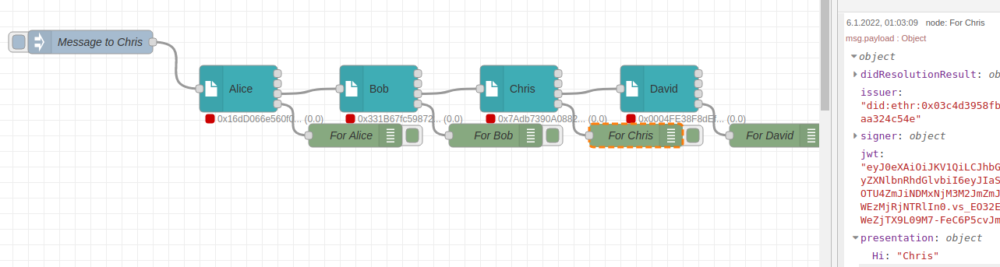

# Cookbook: Building a JWT/DID Message bus

<a href="https://stromdao.de/" target="_blank" title="STROMDAO - Digital Energy Infrastructure"></a>

Node-RED got designed for event processing in an environment like IoT. As soon as something happens a message gets transferred from one task (node) to another.  One of the challenges in business processes, especially if it comes to Smart Contracts or distributed rules engines,  is a need to build a kind of message bus, allowing each task/node to receive (all) messages and forward them to each of the other nodes.

The solution is a design pattern that helps to streamline your flow. Connect the third output of each SmartContractTX with its following SmartContractTX input. In the original presentation use the `_presentTo` parameter to send a presentation to a specific node. Each node will forward it to the next node as the third output until the presentation reaches its final recipient. The positive side effect, none of the transition nodes is able to read the payload data as it is encrypted.



## Use Case

Alice wants to send a presentation that could only be seen (encrypted) to Chris. However Alice could only send directly to Bob.

## Implementation

Via the injection node set `msg.payload` to the following JSON Object:

```Javascript
{
    "presentation": {
        "Hi": "Chris"
    },
    "presentTo": "did:ethr:0x03ae10722203790a4c0183fc8c637745c6630330ddfd58a5efd98af615340ee488"
}
```

Now trigger the flow once so that (after a few seconds) all SmartContractTX nodes have a newly created keypair.

Look at the Context-Data of the Chris Node and copy from `keys-identifier` the public DID from Chis.

Past it into `presentTo` of the inject node.

## Flow
