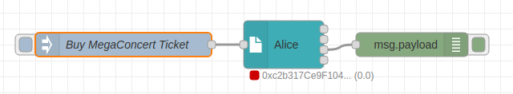

# Cookbook: Presentation Processing Service (PPS)

<a href="https://stromdao.de/" target="_blank" title="STROMDAO - Digital Energy Infrastructure"></a>

If a presentation is received a Presentation Processing Service might be called to process its content and derive further activity.

The strength of Node-RED is to process events and route them. However general CRUD operations or even business processes sometimes get hard to model out. This is the place where a PPS steps in.  It takes presented data and decorates it with whatever is needed to continue with the original flow without having to implement all the processing there. Usage of PPS allows separating key management and SmartContractTX related functions with business rules of another domain or entity.

In general, the PPS is a micro-service interface that listens to HTTP-POST requests coming from a SmartContractTX. The SmartContractTX will include a JWT-DID signed by itself in the request body in a field called `jwt`. By doing this the micro-service could ensure the origin sending node (SmartContractTX) and integrity of the data.  

## Use Case

TicketA is an agent for event tickets. Alice wants to visit a particular event and needs a ticket. She sends a presentation with the order intent to TicketA where a PresentationProcessingService is used to assign the ticket Alice for the event and provides a presentation back to Alice.

### Step 1: Create Intent

Add a SmartContractTX Node for Alice. If not setup, create a Connection, Contract, DID Resolver without any particular configuration (leave default settings).


Add an Inject Node which provides as `msg.payload` a JSON Object:

```Javascript
{
    "presentation": {
        "event": "Mega Concert"
    }
}
```



You might add a Debug-Node to the third Output of Alice to quickly test the result.

Flow: https://gist.github.com/zoernert/b388a58d3b1e16bf6504f478e1e3dbe2

If you click now on the Inject button you will see a JWT in the Debug Console. You might quickly check its content using [jwt.io](https://jwt.io).

### Step 2: Add TicketA Node

As the Buy Ticket Intent should be processed by TicketA we will create a second SmartContractTX Node for TicketA and wire the third output of Alice with the Input of it. The configuration settings of this SmartContractTX Node are again all default.


You might add a Debug-Node to the fourth Output of TicketA to see the effect of the PPS later.

### Step 3: Implement PPS  

In the real world, you would not do this in Node-RED and we will only do a kind of a mock-up to illustrate the usage of a PPS. So what our PPS will do is count the number of tickets sold per event and provide the sequence number (counter) and the owner (here Alice) back in its result.

As a PPS receives an HTTP-Post call, we use a `http-in` Node and configure it:


