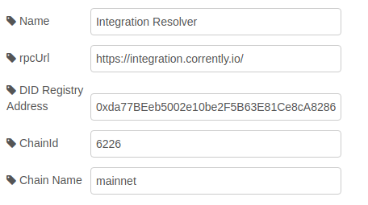

# Use Case: Call Method on SmartContract

<a href="https://stromdao.de/" target="_blank" title="STROMDAO - Digital Energy Infrastructure"></a>

Retrieve the [USDT](https://etherscan.io/token/0xa0b86991c6218b36c1d19d4a2e9eb0ce3606eb48) total supply and return it in debug output.


## Prerequisites

In order to reproduce this Use Case you need an RPC connection to the Ethereum Main Blockchain (Homestead). You could either setup a `geth` node on your computer and get it synced or register for an account on https://infura.io/ .

Sample RPC Url: https://mainnet.infura.io/v3/d254009fd63f4c2bb4596685c0b93d73

## Configuration / Setup


### Connection


You do not have to specify a privateKey. A new one will be generated on first execution of the node.

### Contract


The address of the deployed ERC-20 Token is `0xa0b86991c6218b36c1d19d4a2e9eb0ce3606eb48`. The ABI could be taken from [ethereumdev](https://ethereumdev.io/abi-for-erc20-contract-on-ethereum/)

### DID Resolver/Verifier



We do not need any DIDResolver for this use-case so we could stick with the defaults:
- rpcUrl: `https://integration.corrently.io/`
- DID Registry: `0xda77BEeb5002e10be2F5B63E81Ce8cA8286D4335`
- ChainId: `6226`
- Chain Name: `mainnet`

### Inject

Last step is to modify the inject node. As `msg.payload` we specify that the method `totalSupply()` get called.

```javascript
{
    "method": "totalSupply"
}
```

## Flow

```javascript
[{"id":"5a9d6280bc79ff5e","type":"tab","label":"UC1 - Call SC Method","disabled":false,"info":"Retrieve the [USDT](https://etherscan.io/token/0xa0b86991c6218b36c1d19d4a2e9eb0ce3606eb48) total supply and return. Use Infura RPC service to connect to public Ethereum blockchain (homestead)"},{"id":"87259b3e4ff79d90","type":"SmartContract","z":"5a9d6280bc79ff5e","name":"USDT Coin","Connection":"4639528c2974a261","Contract":"d1b480230ecddef7","Resolver":"79856bb80496c409","AllowInject":"","x":390,"y":120,"wires":[[],["c60e2b71de766e44"],[],[]]},{"id":"809be911b7a25245","type":"inject","z":"5a9d6280bc79ff5e","name":"","props":[{"p":"payload"},{"p":"topic","vt":"str"}],"repeat":"","crontab":"","once":false,"onceDelay":0.1,"topic":"","payload":"{\"method\":\"totalSupply\"}","payloadType":"json","x":190,"y":120,"wires":[["87259b3e4ff79d90"]]},{"id":"c60e2b71de766e44","type":"debug","z":"5a9d6280bc79ff5e","name":"Total Supply Output","active":true,"tosidebar":true,"console":false,"tostatus":false,"complete":"payload","targetType":"msg","statusVal":"","statusType":"auto","x":630,"y":120,"wires":[]},{"id":"4639528c2974a261","type":"DLTConnection","name":"Infura ","rpcUrl":"https://mainnet.infura.io/v3/d254009fd63f4c2bb4596685c0b93d73","privateKey":""},{"id":"d1b480230ecddef7","type":"Contract","name":"USDT ERC-20","address":"0xa0b86991c6218b36c1d19d4a2e9eb0ce3606eb48","ABI":"[\n    {\n        \"constant\": true,\n        \"inputs\": [],\n        \"name\": \"name\",\n        \"outputs\": [\n            {\n                \"name\": \"\",\n                \"type\": \"string\"\n            }\n        ],\n        \"payable\": false,\n        \"stateMutability\": \"view\",\n        \"type\": \"function\"\n    },\n    {\n        \"constant\": false,\n        \"inputs\": [\n            {\n                \"name\": \"_spender\",\n                \"type\": \"address\"\n            },\n            {\n                \"name\": \"_value\",\n                \"type\": \"uint256\"\n            }\n        ],\n        \"name\": \"approve\",\n        \"outputs\": [\n            {\n                \"name\": \"\",\n                \"type\": \"bool\"\n            }\n        ],\n        \"payable\": false,\n        \"stateMutability\": \"nonpayable\",\n        \"type\": \"function\"\n    },\n    {\n        \"constant\": true,\n        \"inputs\": [],\n        \"name\": \"totalSupply\",\n        \"outputs\": [\n            {\n                \"name\": \"\",\n                \"type\": \"uint256\"\n            }\n        ],\n        \"payable\": false,\n        \"stateMutability\": \"view\",\n        \"type\": \"function\"\n    },\n    {\n        \"constant\": false,\n        \"inputs\": [\n            {\n                \"name\": \"_from\",\n                \"type\": \"address\"\n            },\n            {\n                \"name\": \"_to\",\n                \"type\": \"address\"\n            },\n            {\n                \"name\": \"_value\",\n                \"type\": \"uint256\"\n            }\n        ],\n        \"name\": \"transferFrom\",\n        \"outputs\": [\n            {\n                \"name\": \"\",\n                \"type\": \"bool\"\n            }\n        ],\n        \"payable\": false,\n        \"stateMutability\": \"nonpayable\",\n        \"type\": \"function\"\n    },\n    {\n        \"constant\": true,\n        \"inputs\": [],\n        \"name\": \"decimals\",\n        \"outputs\": [\n            {\n                \"name\": \"\",\n                \"type\": \"uint8\"\n            }\n        ],\n        \"payable\": false,\n        \"stateMutability\": \"view\",\n        \"type\": \"function\"\n    },\n    {\n        \"constant\": true,\n        \"inputs\": [\n            {\n                \"name\": \"_owner\",\n                \"type\": \"address\"\n            }\n        ],\n        \"name\": \"balanceOf\",\n        \"outputs\": [\n            {\n                \"name\": \"balance\",\n                \"type\": \"uint256\"\n            }\n        ],\n        \"payable\": false,\n        \"stateMutability\": \"view\",\n        \"type\": \"function\"\n    },\n    {\n        \"constant\": true,\n        \"inputs\": [],\n        \"name\": \"symbol\",\n        \"outputs\": [\n            {\n                \"name\": \"\",\n                \"type\": \"string\"\n            }\n        ],\n        \"payable\": false,\n        \"stateMutability\": \"view\",\n        \"type\": \"function\"\n    },\n    {\n        \"constant\": false,\n        \"inputs\": [\n            {\n                \"name\": \"_to\",\n                \"type\": \"address\"\n            },\n            {\n                \"name\": \"_value\",\n                \"type\": \"uint256\"\n            }\n        ],\n        \"name\": \"transfer\",\n        \"outputs\": [\n            {\n                \"name\": \"\",\n                \"type\": \"bool\"\n            }\n        ],\n        \"payable\": false,\n        \"stateMutability\": \"nonpayable\",\n        \"type\": \"function\"\n    },\n    {\n        \"constant\": true,\n        \"inputs\": [\n            {\n                \"name\": \"_owner\",\n                \"type\": \"address\"\n            },\n            {\n                \"name\": \"_spender\",\n                \"type\": \"address\"\n            }\n        ],\n        \"name\": \"allowance\",\n        \"outputs\": [\n            {\n                \"name\": \"\",\n                \"type\": \"uint256\"\n            }\n        ],\n        \"payable\": false,\n        \"stateMutability\": \"view\",\n        \"type\": \"function\"\n    },\n    {\n        \"payable\": true,\n        \"stateMutability\": \"payable\",\n        \"type\": \"fallback\"\n    },\n    {\n        \"anonymous\": false,\n        \"inputs\": [\n            {\n                \"indexed\": true,\n                \"name\": \"owner\",\n                \"type\": \"address\"\n            },\n            {\n                \"indexed\": true,\n                \"name\": \"spender\",\n                \"type\": \"address\"\n            },\n            {\n                \"indexed\": false,\n                \"name\": \"value\",\n                \"type\": \"uint256\"\n            }\n        ],\n        \"name\": \"Approval\",\n        \"type\": \"event\"\n    },\n    {\n        \"anonymous\": false,\n        \"inputs\": [\n            {\n                \"indexed\": true,\n                \"name\": \"from\",\n                \"type\": \"address\"\n            },\n            {\n                \"indexed\": true,\n                \"name\": \"to\",\n                \"type\": \"address\"\n            },\n            {\n                \"indexed\": false,\n                \"name\": \"value\",\n                \"type\": \"uint256\"\n            }\n        ],\n        \"name\": \"Transfer\",\n        \"type\": \"event\"\n    }\n]"},{"id":"79856bb80496c409","type":"Resolver","name":"Integration Resolver","resolverRpcUrl":"https://integration.corrently.io/","address":"0xda77BEeb5002e10be2F5B63E81Ce8cA8286D4335","chainId":"6226","chainName":"mainnet"}]
```
