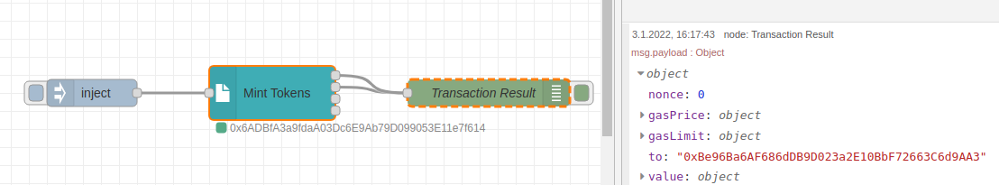
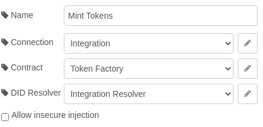
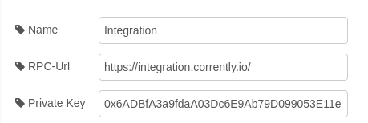
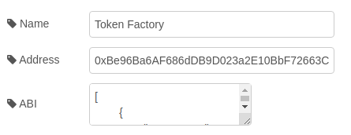

# Use Case: Issue Transaction  

<a href="https://stromdao.de/" target="_blank" title="STROMDAO - Digital Energy Infrastructure"></a>

Create a new ERC20 Token with a factory contract. Issue (mint) 20 tokens to the author.  



## Prerequisites

In order to follow this description we are connecting to the Corrently Integration Blockchain and use a given Private Key. Even if we try to *refill* the ETHs from time to time, it might be that you could not pay for the transaction gas. In this case send a mail to dev@stromdao.com .

## Configuration / Setup



### Connection



- rpcUrl: 'https://integration.corrently.io'
- Private Key: `0x6ADBfA3a9fdaA03Dc6E9Ab79D099053E11e7f614`

### Contract



The address of the deployed ERC-20 Token Factory is `0xBe96Ba6AF686dDB9D023a2E10BbF72663C6d9AA3`.

The ABI:
```javascript
[
	{
		"anonymous": false,
		"inputs": [
			{
				"indexed": true,
				"internalType": "address",
				"name": "owner",
				"type": "address"
			},
			{
				"indexed": false,
				"internalType": "address",
				"name": "erc20",
				"type": "address"
			},
			{
				"indexed": false,
				"internalType": "uint256",
				"name": "lastSupply",
				"type": "uint256"
			}
		],
		"name": "Close",
		"type": "event"
	},
	{
		"inputs": [
			{
				"internalType": "address",
				"name": "owner",
				"type": "address"
			}
		],
		"name": "closeToken",
		"outputs": [
			{
				"internalType": "uint256",
				"name": "supply",
				"type": "uint256"
			}
		],
		"stateMutability": "nonpayable",
		"type": "function"
	},
	{
		"anonymous": false,
		"inputs": [
			{
				"indexed": true,
				"internalType": "address",
				"name": "owner",
				"type": "address"
			},
			{
				"indexed": false,
				"internalType": "address",
				"name": "erc20",
				"type": "address"
			}
		],
		"name": "Create",
		"type": "event"
	},
	{
		"inputs": [
			{
				"internalType": "address",
				"name": "to",
				"type": "address"
			},
			{
				"internalType": "uint256",
				"name": "value",
				"type": "uint256"
			}
		],
		"name": "mint",
		"outputs": [
			{
				"internalType": "bool",
				"name": "success",
				"type": "bool"
			}
		],
		"stateMutability": "nonpayable",
		"type": "function"
	},
	{
		"anonymous": false,
		"inputs": [
			{
				"indexed": true,
				"internalType": "address",
				"name": "to",
				"type": "address"
			},
			{
				"indexed": false,
				"internalType": "uint256",
				"name": "value",
				"type": "uint256"
			}
		],
		"name": "Mint",
		"type": "event"
	},
	{
		"anonymous": false,
		"inputs": [
			{
				"indexed": true,
				"internalType": "address",
				"name": "previousOwner",
				"type": "address"
			},
			{
				"indexed": true,
				"internalType": "address",
				"name": "newOwner",
				"type": "address"
			}
		],
		"name": "OwnershipTransferred",
		"type": "event"
	},
	{
		"inputs": [],
		"name": "renounceOwnership",
		"outputs": [],
		"stateMutability": "nonpayable",
		"type": "function"
	},
	{
		"inputs": [
			{
				"internalType": "address",
				"name": "newOwner",
				"type": "address"
			}
		],
		"name": "transferOwnership",
		"outputs": [],
		"stateMutability": "nonpayable",
		"type": "function"
	},
	{
		"inputs": [],
		"name": "owner",
		"outputs": [
			{
				"internalType": "address",
				"name": "",
				"type": "address"
			}
		],
		"stateMutability": "view",
		"type": "function"
	},
	{
		"inputs": [
			{
				"internalType": "address",
				"name": "",
				"type": "address"
			}
		],
		"name": "tokens",
		"outputs": [
			{
				"internalType": "contract GeneralToken",
				"name": "",
				"type": "address"
			}
		],
		"stateMutability": "view",
		"type": "function"
	}
]
```

### DID Resolver/Verifier


We do not need any DIDResolver for this use-case so we could stick with the defaults:
- rpcUrl: `https://integration.corrently.io/`
- DID Registry: `0xda77BEeb5002e10be2F5B63E81Ce8cA8286D4335`
- ChainId: `6226`
- Chain Name: `mainnet`

### Inject

Last step is to modify the inject node. As `msg.payload` we specify that the method `totalSupply()` get called.

```javascript
{
    "method": "mint",
    "args": [
        "0x164a52E0a2bca1c75A3997a7c5A2dbe0aB3e0fF3",
        20
    ]
}
```

## Flow

```javascript
[{"id":"5a9d6280bc79ff5e","type":"tab","label":"UC2 - Transaction","disabled":false,"info":"Create a new ERC-20 Token owned by myself and mint (issue) a few tokens to the author."},{"id":"87259b3e4ff79d90","type":"SmartContract","z":"5a9d6280bc79ff5e","name":"Mint Tokens","Connection":"709fcd56ae2bfcc5","Contract":"d1b480230ecddef7","Resolver":"79856bb80496c409","AllowInject":"","x":390,"y":120,"wires":[["c60e2b71de766e44"],["c60e2b71de766e44"],[],[]]},{"id":"809be911b7a25245","type":"inject","z":"5a9d6280bc79ff5e","name":"","props":[{"p":"payload"},{"p":"topic","vt":"str"}],"repeat":"","crontab":"","once":false,"onceDelay":0.1,"topic":"","payload":"{\"method\":\"mint\",\"args\":[\"0x164a52E0a2bca1c75A3997a7c5A2dbe0aB3e0fF3\",20]}","payloadType":"json","x":190,"y":120,"wires":[["87259b3e4ff79d90"]]},{"id":"c60e2b71de766e44","type":"debug","z":"5a9d6280bc79ff5e","name":"Transaction Result","active":true,"tosidebar":true,"console":false,"tostatus":false,"complete":"payload","targetType":"msg","statusVal":"","statusType":"auto","x":630,"y":120,"wires":[]},{"id":"709fcd56ae2bfcc5","type":"DLTConnection","name":"Integration","rpcUrl":"https://integration.corrently.io/","privateKey":"0x6ADBfA3a9fdaA03Dc6E9Ab79D099053E11e7f614"},{"id":"d1b480230ecddef7","type":"Contract","name":"Token Factory","address":"0xBe96Ba6AF686dDB9D023a2E10BbF72663C6d9AA3","ABI":"[\n\t{\n\t\t\"anonymous\": false,\n\t\t\"inputs\": [\n\t\t\t{\n\t\t\t\t\"indexed\": true,\n\t\t\t\t\"internalType\": \"address\",\n\t\t\t\t\"name\": \"owner\",\n\t\t\t\t\"type\": \"address\"\n\t\t\t},\n\t\t\t{\n\t\t\t\t\"indexed\": false,\n\t\t\t\t\"internalType\": \"address\",\n\t\t\t\t\"name\": \"erc20\",\n\t\t\t\t\"type\": \"address\"\n\t\t\t},\n\t\t\t{\n\t\t\t\t\"indexed\": false,\n\t\t\t\t\"internalType\": \"uint256\",\n\t\t\t\t\"name\": \"lastSupply\",\n\t\t\t\t\"type\": \"uint256\"\n\t\t\t}\n\t\t],\n\t\t\"name\": \"Close\",\n\t\t\"type\": \"event\"\n\t},\n\t{\n\t\t\"inputs\": [\n\t\t\t{\n\t\t\t\t\"internalType\": \"address\",\n\t\t\t\t\"name\": \"owner\",\n\t\t\t\t\"type\": \"address\"\n\t\t\t}\n\t\t],\n\t\t\"name\": \"closeToken\",\n\t\t\"outputs\": [\n\t\t\t{\n\t\t\t\t\"internalType\": \"uint256\",\n\t\t\t\t\"name\": \"supply\",\n\t\t\t\t\"type\": \"uint256\"\n\t\t\t}\n\t\t],\n\t\t\"stateMutability\": \"nonpayable\",\n\t\t\"type\": \"function\"\n\t},\n\t{\n\t\t\"anonymous\": false,\n\t\t\"inputs\": [\n\t\t\t{\n\t\t\t\t\"indexed\": true,\n\t\t\t\t\"internalType\": \"address\",\n\t\t\t\t\"name\": \"owner\",\n\t\t\t\t\"type\": \"address\"\n\t\t\t},\n\t\t\t{\n\t\t\t\t\"indexed\": false,\n\t\t\t\t\"internalType\": \"address\",\n\t\t\t\t\"name\": \"erc20\",\n\t\t\t\t\"type\": \"address\"\n\t\t\t}\n\t\t],\n\t\t\"name\": \"Create\",\n\t\t\"type\": \"event\"\n\t},\n\t{\n\t\t\"inputs\": [\n\t\t\t{\n\t\t\t\t\"internalType\": \"address\",\n\t\t\t\t\"name\": \"to\",\n\t\t\t\t\"type\": \"address\"\n\t\t\t},\n\t\t\t{\n\t\t\t\t\"internalType\": \"uint256\",\n\t\t\t\t\"name\": \"value\",\n\t\t\t\t\"type\": \"uint256\"\n\t\t\t}\n\t\t],\n\t\t\"name\": \"mint\",\n\t\t\"outputs\": [\n\t\t\t{\n\t\t\t\t\"internalType\": \"bool\",\n\t\t\t\t\"name\": \"success\",\n\t\t\t\t\"type\": \"bool\"\n\t\t\t}\n\t\t],\n\t\t\"stateMutability\": \"nonpayable\",\n\t\t\"type\": \"function\"\n\t},\n\t{\n\t\t\"anonymous\": false,\n\t\t\"inputs\": [\n\t\t\t{\n\t\t\t\t\"indexed\": true,\n\t\t\t\t\"internalType\": \"address\",\n\t\t\t\t\"name\": \"to\",\n\t\t\t\t\"type\": \"address\"\n\t\t\t},\n\t\t\t{\n\t\t\t\t\"indexed\": false,\n\t\t\t\t\"internalType\": \"uint256\",\n\t\t\t\t\"name\": \"value\",\n\t\t\t\t\"type\": \"uint256\"\n\t\t\t}\n\t\t],\n\t\t\"name\": \"Mint\",\n\t\t\"type\": \"event\"\n\t},\n\t{\n\t\t\"anonymous\": false,\n\t\t\"inputs\": [\n\t\t\t{\n\t\t\t\t\"indexed\": true,\n\t\t\t\t\"internalType\": \"address\",\n\t\t\t\t\"name\": \"previousOwner\",\n\t\t\t\t\"type\": \"address\"\n\t\t\t},\n\t\t\t{\n\t\t\t\t\"indexed\": true,\n\t\t\t\t\"internalType\": \"address\",\n\t\t\t\t\"name\": \"newOwner\",\n\t\t\t\t\"type\": \"address\"\n\t\t\t}\n\t\t],\n\t\t\"name\": \"OwnershipTransferred\",\n\t\t\"type\": \"event\"\n\t},\n\t{\n\t\t\"inputs\": [],\n\t\t\"name\": \"renounceOwnership\",\n\t\t\"outputs\": [],\n\t\t\"stateMutability\": \"nonpayable\",\n\t\t\"type\": \"function\"\n\t},\n\t{\n\t\t\"inputs\": [\n\t\t\t{\n\t\t\t\t\"internalType\": \"address\",\n\t\t\t\t\"name\": \"newOwner\",\n\t\t\t\t\"type\": \"address\"\n\t\t\t}\n\t\t],\n\t\t\"name\": \"transferOwnership\",\n\t\t\"outputs\": [],\n\t\t\"stateMutability\": \"nonpayable\",\n\t\t\"type\": \"function\"\n\t},\n\t{\n\t\t\"inputs\": [],\n\t\t\"name\": \"owner\",\n\t\t\"outputs\": [\n\t\t\t{\n\t\t\t\t\"internalType\": \"address\",\n\t\t\t\t\"name\": \"\",\n\t\t\t\t\"type\": \"address\"\n\t\t\t}\n\t\t],\n\t\t\"stateMutability\": \"view\",\n\t\t\"type\": \"function\"\n\t},\n\t{\n\t\t\"inputs\": [\n\t\t\t{\n\t\t\t\t\"internalType\": \"address\",\n\t\t\t\t\"name\": \"\",\n\t\t\t\t\"type\": \"address\"\n\t\t\t}\n\t\t],\n\t\t\"name\": \"tokens\",\n\t\t\"outputs\": [\n\t\t\t{\n\t\t\t\t\"internalType\": \"contract GeneralToken\",\n\t\t\t\t\"name\": \"\",\n\t\t\t\t\"type\": \"address\"\n\t\t\t}\n\t\t],\n\t\t\"stateMutability\": \"view\",\n\t\t\"type\": \"function\"\n\t}\n]"},{"id":"79856bb80496c409","type":"Resolver","name":"Integration Resolver","resolverRpcUrl":"https://integration.corrently.io/","address":"0xda77BEeb5002e10be2F5B63E81Ce8cA8286D4335","chainId":"6226","chainName":"mainnet"}]
```
