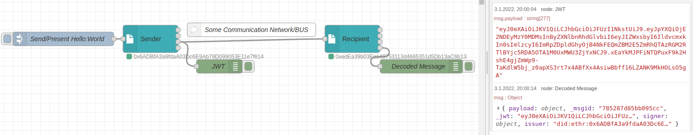
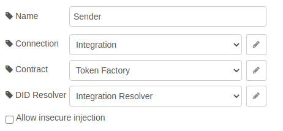
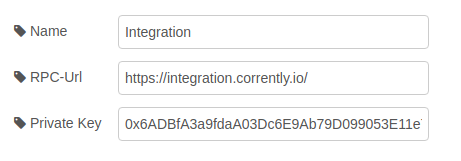
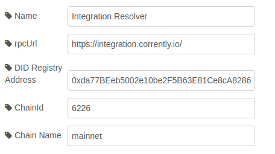

# Use Case: Verifiable Presentation  

<a href="https://stromdao.de/" target="_blank" title="STROMDAO - Digital Energy Infrastructure"></a>

Signing a dataset (JSON Object) and encode it as a JSON-WebToken [JWT](https://jwt.io/) encapsulated DID.   



## Background

The message signed and send is a simple JSON `{"hello":"world"}`. On the network everyone could read the message - however it could not be modified. The recipient could ensure that the message is signed by the sender by looking into the resulting msg object `msg.signer`.

In this sample the default configuration is used which uses the resolver contract and rpc-service https://integration.corrently.io/

## Configuration / Setup



Sender and Recipient could be configured same!

### Connection



- rpcUrl: 'https://integration.corrently.io'
- Private Key: `0x6ADBfA3a9fdaA03Dc6E9Ab79D099053E11e7f614`

If you want to use the same settings, you might use this privateKey - however if you do not specify a privateKey a new keypair is generated on first run.

### Contract

No configuration required here.

### DID Resolver/Verifier



The defaults should be fine:
- rpcUrl: `https://integration.corrently.io/`
- DID Registry: `0xda77BEeb5002e10be2F5B63E81Ce8cA8286D4335`
- ChainId: `6226`
- Chain Name: `mainnet`

### Inject

In `msg.payload` we set the JSON:

```javascript
{
    "presentation": {
        "Hello": "World"
    }
}
```

## Flow

Available on [GIST](https://gist.github.com/7e5a178be6a525bf4be6cc87152fed85)
