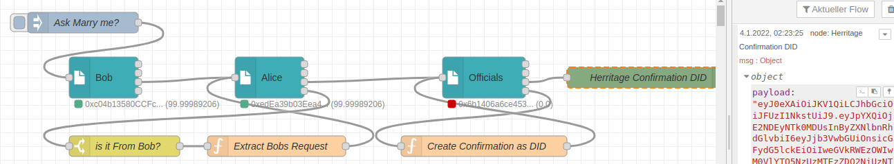

# Use Case: Digital Freddy  

<a href="https://stromdao.de/" target="_blank" title="STROMDAO - Digital Energy Infrastructure"></a>

Bob sends Alice an encrypted and signed message that he wants marry her. Alice takes this as a *Verifiable Credential* , aknowledges with her signature and sends it without encryption to the officials.

Okey, in this simplified example the officials could only confirm that a signer address `0xc04b...` wants to mary address `0xedEa...`. The addresses that belong to Alice's and Bob's private key. But - why not ... if someone asks both could demonstrate with a new document that they are married.



Generated DID:
```javascript
{
  "iat": 1641259277,
  "presentation": {
    "couple": {
      "partnerA": "0xedEa39b03Eea49753113d4665351d5Db13aC6b13",
      "partnerB": "0xc04b13580CCFca2aA4C65862C21829E8AB3a1803"
    }
  },
  "iss": "did:ethr:0x02ea8931d906f4406a2dcead731c69a0b3660e319650c6466ad26abfb5f77e86b0"
}
```

## Reproduce

In Setup the flow and configure all `SmartContractTx` Nodes with default settings (Bob, Alice, Officals).

As new private keys get generated you need to get some ETHs on the Corrently integration chain in order to use the address as identifier. You might get them by sending the generated addresses to dev@stromdao.com . Alternatively you could copy and past the public key of Alice into the `Ask Marry me?` Injection in `presentTo`.

## Flow

Available on [GIST](https://gist.github.com/7e5a178be6a525bf4be6cc87152fed85)
